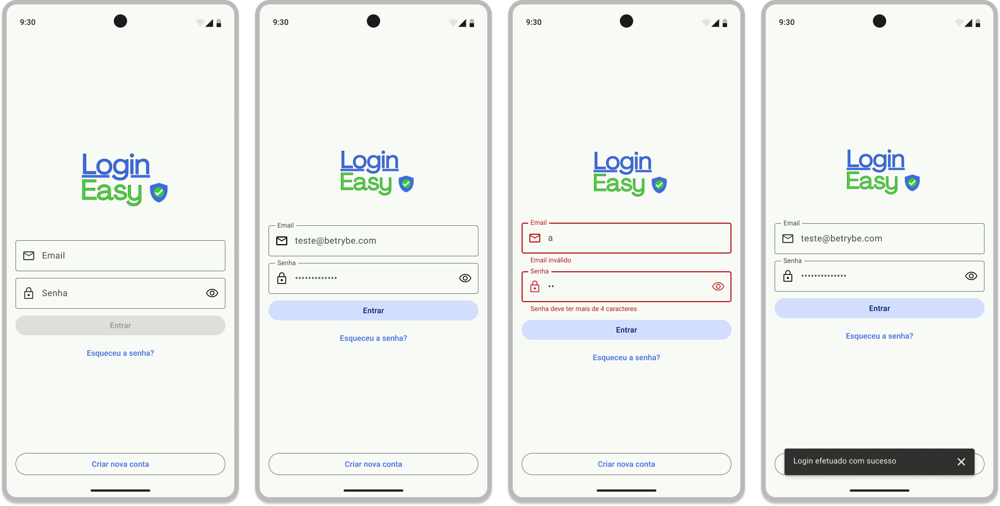

# Tela de Login - Rede Social

## Sobre o Projeto
Desenvolvi uma tela de login completa para rede social usando Android nativo e Kotlin. O objetivo foi criar uma interface intuitiva que permite aos usuários acessarem suas contas de forma simples e segura, oferecendo também opções para recuperação de senha e cadastro de novos usuários.

## Preview

  

## O que ela faz?
A tela conta com todas as funcionalidades essenciais para um sistema de login:
- Validação em tempo real do formato do email
- Verificação da senha com requisitos mínimos de segurança
- Botão de login que só ativa quando os campos são preenchidos corretamente
- Opções para recuperar senha esquecida
- Botão para cadastro de novos usuários
- Feedback visual através de mensagens claras para o usuário

## Como foi feito?
Para construir essa interface, utilizei:
- Kotlin como linguagem principal
- Componentes do Material Design 3 para uma interface moderna
- ViewGroups para organização do layout (ConstraintLayout e LinearLayout)
- Sistema de validação em tempo real
- Testes automatizados com Espresso
- Análise de código com Ktlint e Detekt

## Orientações

#### 1. Clone o repositório

- Use o comando: `git clone https://github.com/alexcssilva/login-interface.git`

#### 2. Instale as dependências

- Entre no arquivo `build.gradle` localizado dentro do diretório **app**

- Clique no botão `Sync Now` caso ele exista; se a opção não estiver disponível, significa que a sincronização automática já foi realizada ao abrir o Android Studio.

#### 3. Testes

Abra a aba `Run` e selecione o arquivo de teste: <strong>MainActivityTest</strong>

## Para que serve?
Essa tela é o ponto de entrada da rede social, onde os usuários podem:
- Entrar em suas contas existentes
- Recuperar acesso caso esqueçam suas senhas
- Iniciar o processo de criação de uma nova conta

Todo o desenvolvimento foi pensado para criar uma experiência fluida e agradável, seguindo os padrões modernos de design do Android.

---
Desenvolvido por Alex Silva - [@alexcssilva](https://github.com/alexcssilva)
